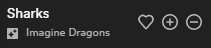

# Enhance Plus
Currently Spotify does not allows you to add a recommended song to your playlist without having to find it in the playlist which can be very annoying if your playlist have a certain amount of songs, this extension was made to solve that problem. As shown below.



## Table of contents
  - [Installation](#installation)
  - [Usage](#usage)
  - [Report a Bug](#bugs)
  - [Misc](#misc)

## Installation
Copy [enhance-plus.js](https://github.com/Aztup/EnhancePlus/blob/master/dist/enhance-plus.js) and drag it to the spicetify extenstions folder
| **Platform**    | **Path**                               |
|-----------------|----------------------------------------|
| **MacOs/Linux** | `~/.config/spicetify/Extensions`       |
| **Windows**     | `%appdata%\spicetify\Extensions` |

Run the following commands
```sh
spicetify config extensions enhance-plus.js
spicetify apply
```

## Usage
To use this extension play a recommended song and you'll see [2 button appears](https://github.com/Aztup/EnhancePlus/blob/master/preview.png) to add/remove this recommended song from your playlist

## Bugs
If you find any bugs please feel free to open an issue on the [github](https://github.com/Aztup/EnhancePlus/issues/new) page

## Misc
If you like the extension don't hesitate to like it here
[](https://github.com/Aztup/EnhancePlus/)
